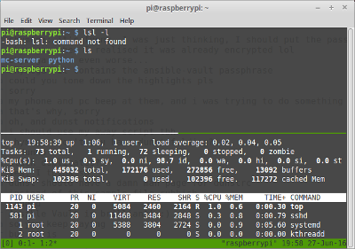

### Software tools

This page is designed to list some tools that we find useful:

####Linux

tmux - Terminal MUltipleXer :  This tool allows you to run more than one command line within a console or xterm window.  This saves:

* Opening up multiple consoles (ctrl-alt-fn)
* Opening up multiple terminals (ctrl-alt-t)
* running more than one ssh session (ssh user@host)

I will be giving a demonstration of this at a future tech jam.

####Windows

####OSX
