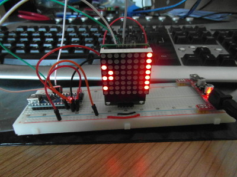

### Workshops

The Torbay Tech jam also present workshops where we can give visitors a chance to build cool projects and at the same time introduce them to different hardware platforms.

For example Tom Brough has recently been presenting a workshop to build a LED Matrix scrolling message display, powered by the Arduino Nano Micro-controller board.

There will be a charge of £15  for this to cover all parts,

   * Arduino Nano
   * Breadboard
   * Wires (x5)
   * LED matrix and controller board
   	

Once built you can use the Arduino IDE software to update the message on the display,  add further 8x8 matrix displays or use the kit for other projects.  You could perhaps add a temperature sensor. 

To help you get started The nano will initially be pre-programmed, but the source code for the workshop will be made available so that you can change the message by uploading a new sketch to the Arduino.

Tom has put together a presentation to explain how the project works and how to build.

If you’re interested please e-mail >info [AT] torbaytechjam [DOT] org [DOT] uk< or speak to Tom Brough at the jam. 

Other workshops include :

* [Minecraft modding](minecraft_modding.md) (this is in development). Please see matthew for details. 
* Obstacle avoiding robot (please see Tom Brough)
* Basic arduino / pi interfacing

Some of these workshops carry a charge, others are free and others may require you to install software or do other preparation before hand. 
